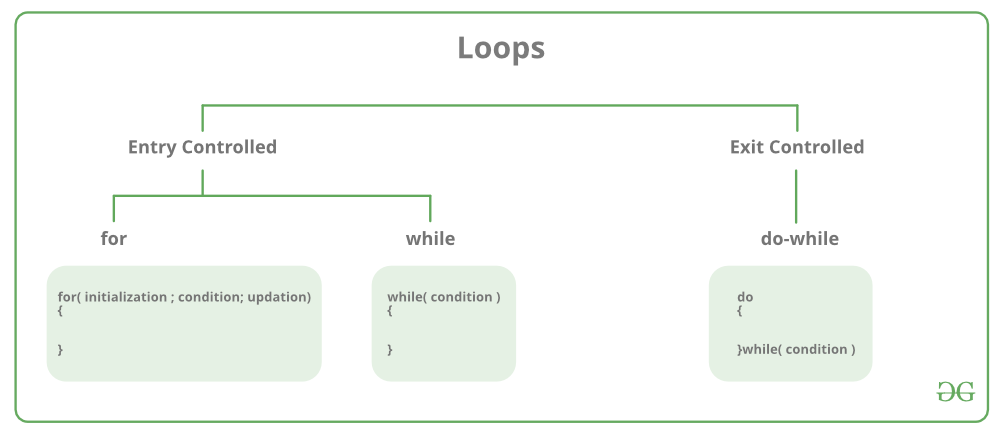

# Programming Language Project C++

 ### History
 C++ is an object-oriented programming language that combines low-level and high-level language.
 It was created and developed by Danish computer scientist Bjarne Stroustrup inspired by the
 struggles in his PhD experience with C and simulation languages like Simula. C++'s development
 began in 1979 is the [fourth most popular programming language today](https://www.tiobe.com/tiobe-index/).
 
 C++ has many different applications and is used to code operating systems, video games, databases,
 web browsers, Internet of Things (IoT) devices, virtual reality experiences, flight simulation
 software, and more.
 
 
 
 ### Examples of software written in C++ include:
 
 - Google Chrome Browser
 - Mozilla Firefox
 - MySQL server 
 - Adobe Photoshop and Adobe Illustrator
 - Maya (3D software used for animation and other graphics)


### Resources for Future Programming


**Videos**

 [Beginner Video](https://www.google.com/url?sa=t&rct=j&q=&esrc=s&source=web&cd=&cad=rja&uact=8&ved=2ahUKEwirkbbYjZP6AhVNjIkEHQ4yAaQQwqsBegQICBAB&url=https%3A%2F%2Fwww.youtube.com%2Fwatch%3Fv%3DMcojvctVsUs&usg=AOvVaw3KT81R3m7JUGuRSPkNg3Io)
 
 [GUI Apps in C++ Video](https://www.youtube.com/watch?v=FxQTXyR4mjs)
 
 [1 Hour Intro on C++](https://www.youtube.com/watch?v=ZzaPdXTrSb8)
 
 [Free Code Camp 4-Hour Course](https://youtu.be/vLnPwxZdW4Y)
 
 
 
 **Websites**
 
 https://cplusplus.com/doc/tutorial/
 
 https://www.w3schools.com/cpp/cpp_intro.asp
 
 https://www.geeksforgeeks.org/cpp-tutorial/
 
 https://stackoverflow.com/questions/388242/the-definitive-c-book-guide-and-list
 
 https://www.programiz.com/cpp-programming
 


 ### Getting Started
 
 To begin coding in C++ you will need to set some things up first. The first thing to do is
 choose your IDE. I went with Visual Studio Code because I already had this installed and
 I am familiar with using it. Eclipse is another popular option. I also needed to install
 the C++/C extension on VSCode as well as a compiler (I went with Clang). To run a program
 in C++ you will first need to "run build" on your code. This compiles it altogether, and
 then I am able to run the file as usual in VSCode with the Run button. To write a single
 line comment in C++ use two slashes:
 
 // This would be a single line comment
 
 To comment out multiple lines of code, encase the section in slashes and astericks:
 
 /* This can comment out a big chunk of code */
 
 
 
 ### Data Types and Naming Conventions
 
 **Reserved Words**
 
 Some words should not be used as variable, class, file, or function names as they are
 part of built in processes in C++. These reserved key words are: 
 
 
 
 #### Variable Naming Rules
 
 - Variables must be unique from one another (cannot have two variables both named x)
 - Must begin with a letter or underscore (1name is not acceptable but oneName or _Name are)
 - They are case sensitive, making myVariable and myvariable, two different identifiers
 - Variables cannot have spaces or special characters like !, @, $, &, etc.
 - Reserved Words cannot be used
 - Numbers can be a part of a variable as long as they are not at the beginning (hello1 is fine)


 #### Naming Conventions
 
 C++ is a statically typed explicit programming language, which means the data types must be declared. It is strongly typed
 which is enforced by a compiler. This ensures you are not doing something such as trying to add a sentence
 and number together. Variables in C++ are not mutable unless the "mutable" keyword is used before the variable 
 assignment. This allows you to change the value of the variable later on.
 
 C++ **Strings** can be compared and assigned with the standard comparison operators: ==, != , <=, >=, <, >, and =.
 **Assignment** operators can also be used to assign value to strings. For example, x = 12, assigns 12 to x.
 
 **Integers**, **Floats**, and **Doubles** can also use comparison operators as well as arithmatic operators such
 as +, -, *, %, and /. **Increment** and **Decrement** operators can also be used on these number types to increase
 (++) or decrease (--) their value by one.

Typically mixing different data types is avoided in C++. However, when it is utilized types are automatically converted
from "smaller" to "larger" data types. It follows this pattern starting at the lowest:

              char -> short -> int -> long -> float -> double -> long double

So if an int and float are added, they will be converted to the larger "float". However, you cannot add a string and an int.

**Binding**

C++ uses early-binding, where a compiler directly associates an address to the function call. Therefore variables will be bound
when the compiler runs.


### Booleans

While coding **true** or **false** can be used to represent boolean values. However, they are stored as 0 and 1. 

This can be seen in the code example below.

https://github.com/GiannaPetrucci/CS330/blob/7a60adc472fc1a19398e35f96cbc480103fe304d/PLP3/conditionals.cpp#L1-L14


### Conditional Statements

C++ does not have a wide variety of conditional statements. There are **IF** statements which can stand alone. **IF/ELSE** statements, as ELSE cannot
be on its own. **ELSE IF** statements which also cannot be standalone and are wedged in between **IF** and **ELSE** statements. And finally a **SWITCH**
statement, which functions the same as the switch statement in Java condensing different conditions and outcomes into one chunk.

#### Delimiters

Conditions are encased in paretheses. This can be seen in the example below where (firstCondition is true) and (secondCondition is true). Following the 
condition is the result in curly brackets. If the first condition is true then "First Condition True" will be printed. The curly brackets close before the next else if or else statement begins. This pattern would repeat for however many else if statements. 
 
```cpp
if (firstCondition is true) {
  cout << "First Condition True" <<endl;
} else if (secondCondition is true) {
  cout << "First Condition False,Second Condition True" <<endl;
} else {
  cout << "First and Second Conditions are False" <<endl;
}
```

Delimiters are different in **switch statements**. This can be seen in the framework for a switch statement below.

```cpp
switch(expression) {
  case a:
    
    break;
  case b:
    
    break;
  default:
  
  }
    
```

#### Short Circuiting

C++ does utilize short circuit evaluation, which means in an **AND** statement if the first boolean is false, other booleans in the conditional will
not be evaluated. Similarly in **OR** statements, if the first boolean is true, it will not check the other ones. 

https://github.com/GiannaPetrucci/CS330/blob/dda8bcc73f6d0ff4bde2b996eb42ca2d37f19ef3/PLP3/conditionals.cpp#L23-L31
In the example above, the first **IF** statement is false so the **IF ELSE** statement will be evaluated. Because isPython is equal to 0/false which
fulfills the condition the final else statement will not be considered. If there was another **IF ELSE** or five more none would be evaluated because
the first one fulfills the condition. 

#### Dangling Else

An example of a dangling else, where there are nested **IFS** and the **ELSE** does not know which one to go to, can be seen below.

https://github.com/GiannaPetrucci/CS330/blob/54312045e3eee32ac37d4a28720214e8fdb88751/PLP3/danglingElse.cpp#L1-L19

In this scenario x is equal to 12. The first **IF** is false/0 because x does not equal 
10. But the second **IF** does not matter even though it is true, x is smaller than 50.
In this case the second **IF** is passed over and the **ELSE** statement prints out
"dangling else".

#### Note on Switch Statements

Switch statements require **break** keywords after each case. This tells the program that if a case is true, do not test the
others. **Continue** keywords cannot be used in switch statements.


### Loops

There are two categories of loops that can be implemented in C++. The first kind is Entry Controlled. This is where the condition is tested
at the beginning or "entry" before continuing on to the actions taking place in the loop. The second kind is Exit Controlled, where as the name
implies the loop is executed and then the end or "exit" condition is tested. These categories are illustrated in the diagram below from [GeeksforGeeks.org](https://www.geeksforgeeks.org/cpp-loops/).




**For Loop Example**

https://github.com/GiannaPetrucci/CS330/blob/859d3fd7184928be62df2052a12d70fe1f2159ee/PLP4/Loops.cpp#L6-L14

This is the format of a basic For loop. The initilizing, conditional statement, and variable incrementing
are all done in the same paretheses. Then in curly braces is the body of the loop, which will print "Loop
Pass Number:" followed by the loop number, until it reaches the condition of 10. The return statement is needed and it commented out so the other loops on this file can run. 

**While Loop Example**

https://github.com/GiannaPetrucci/CS330/blob/380490b1b125ff3556bd0d42dfe37cf996a25b0e/PLP4/Loops.cpp#L19-L31

A While loop in C++ looks fairly similar to one in Python. The variable is initialized, then 
the condition is run. If the condition is met, the body message will print and the variable
increased by 1. Similar to the For loop above parentheses and curly braces are used. Unlike
Python spacing and indentation does not matter, except for making things more readable.

**Do While Loop**

https://github.com/GiannaPetrucci/CS330/blob/380490b1b125ff3556bd0d42dfe37cf996a25b0e/PLP4/Loops.cpp#L35-L48

The Do While loop uses the same structure of curly braces and parentheses except they appear 
in the reverse order. This is because this loop executes the body (line 40) first and **then**
checks the while condition. This may seem unnatural to Python programmers at first, but this
Exit Controlled type of loop can also be seen in Java. 

This loop will only run and execute once as i is set to 4, then incremented making i = 5, and
then the condition tests is i is not equal to 5, which it does not meet anymore. 


### Functions 

An example of a multiplication function in C++ can be seen below.

https://github.com/GiannaPetrucci/CS330/blob/5d9d95ff9583a02db0b7b1f7296848fb61b63801/PLP4/multiply.cpp#L1-L31

In C++ function declarations can be separated from their definitions. This is because 
functions **must** be declared before the main(). The definition can be before or after. In
this example the definition is after the main() starting on line 28. 

Functions in C++ accept multiple parameters, as shown in the product() function which takes two.
Parameters can be different data types, but here we see two integers a and b. 

**Recursion**

C++ does support recursive functions as shown in the factorial example below.

https://github.com/GiannaPetrucci/CS330/blob/8d93463a987f7ab98eeb1e628dd1a8294fc15c32/PLP4/Factorial.cpp#L1-L26

The function is again declared before main() while the actual definition of the function comes
after. As with recursion in any language you need to test your code as you write it so you
do not accidentally make a function that calls itself infinetly (unless that is it's purpose).

**Returning Multiple Values**

A single function in C++ cannot return multiple values. However there is a work-around. If
multiple values are saved in a tuple. You must make sure "#include <tuple>" is at the beginning
of your code where "#include <iostream>" is located. This will allow you to save three
 values together and return them as a set. 

 
 **Pass by Value or Reference**
 
 C++ uses pass by value by default, but it can be forced to use pass by reference. This is 
 seen in the example below in the first function on line 4. 
 
 https://github.com/GiannaPetrucci/CS330/blob/c6fe4fb20289418aa828a7087eed371d0753fb63/PLP4/ValueReference.cpp#L1-L22
 
 
 
 
 ### Stack and Heap Storage
 
 A diagram for the memory layout of C++ is below. This is a very generalized version and does not 
 include details about specific pointers.
 
 
 
 

 Local variables, arguments, and parameters are stored on the **stack** by default. After a function returns the stack memory
 of that function is automatically deallocated. 
 
 **Heap** memory must be explicitly coded by the programmer and will **not** deallocate automatically. The key word ```new```
 will send that item to the **heap**. In order to deallocate, the ```delete``` keyword will be required.
 
 A basic tutorial on using these keywords can be found [here](https://courses.engr.illinois.edu/cs225/fa2022/resources/stack-heap/).

 
 ###Scope of Variables
 There are two main scopes of variables in C++. They are global and local variables. 
 
 **Local Variables**
 As the name implies, these variables can be found locally/within a function. They cannot be accessed outside of their code block
 or function. For example, in our multiplication function from the **Functions** section above:
 
 ```
 int product(int a, int b)
{
	return (a*b);
}
```
 int a and int b are local variables to the product() function, they cannot be accessed outside of this function. If we try to
 perform division on them outside of their curly braces, we will recieve an error.
